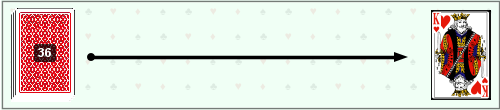

# Документация к системе CDSL (Combinatorial Domain-Specific Language)

## Обзор системы
**CDSL** - это специализированный язык и система для описания и визуализации комбинаторных задач. Система позволяет формализовать задачи из различных областей комбинаторики (карты, слова, шахматы, числа и т.д.) и генерировать их графическое представление.

## Архитектура системы

### 1. Модель данных (cdsl/model)

 - `ProblemType.java` - перечисление типов задач:
   - `CARDS` - задачи, связанные с картами.
   - `WORDS` - задачи, связанные со словами.
   - `CHESS` - задачи, связанные с шахматами.
   - `NUMBERS` - задачи, связанные с числами.
   - `EQUATIONS` - задачи, связанные с уравнениями.
   - `BALLS_AND_URNS` - задачи, связанные с шарами и урнами.
   - `DIVISIBILITY` - задачи, связанные с делимостью.
   - `REMAINDERS` - задачи, связанные с остатками.
 
### 2. Лексический анализ (cdsl/tokenizer)

 - `TokenType.java` - перечисление типов токенов с регулярными выражениями для их распознования
 - `Token.java` - класс для представления токена
 - `CDSLTokenizer` - токенизатор, разбивающий входной текст на токены

### 3. Синтаксический анализ (cdsl/parser)

 - `ASTNode.java` - узел абстрактного синтаксического дерева (AST)
 - `CDSLParser` - парсер, строящий AST из последовательности токенов

### 4. Интерпретатор (cdsl/interpreter)

 - `ProblemContext.java` - объект контекста задачи, содержащий параметры и настройки
 - `ProblemInterpreter.java` - интерпретатор, преобразующий AST в контекст задачи

### 5. Визуализация (service)

 - `ImageGenerator.java` - Основной сервис генерации изображений  
 - Специализированные генераторы для каждого типа задач 

## Процесс обработки задачи

### Шаг 1. Описание задачи на CDSL
Пользователь описывает комбинаторную задачу с использованием синтаксиса CDSL. 
Примеры
```
// Задача с картами
TASK CARDS "Вероятность вытянуть туза пик"
DECK STANDARD 52
DRAW 1 NO_REPLACEMENT
TARGET [ACE SPADES]
CALCULATE PROBABILITY

// Шахматная задача
TASK CHESS "Расстановка ладей"
BOARD_HEIGHT 8
BOARD_WIDTH 8
PIECES [ROOK 2]
ATTACKING
```

### Шаг 2. Лексический анализ (токенизация)
`CDSLTokenizer` разбивает входной текст на токены, используя регулярные выражения из `TokenType.java`.
1. Разделяет текст на строки
2. Обрабатывает каждую строку, выделяя ключевые слова, идентификаторы, числа и символы:
   - Ключевые слова: TASK, DECK, DRAW, TARGET, CALCULATE и т.д.
   - Идентификаторы: имена задач, типов карт, фигур и т.д.
   - Числа: количественные параметры (например, количество карт, размер доски)
   - Символы: скобки, запятые и т.д.
3. Возвращает список объектов `Token`.

### Шаг 3. Синтаксический анализ (парсинг)
`CDSLParser.parse()` строит абстрактное синтаксическое дерево (AST):
1. Читает токены последовательно 
2. Распознает конструкции языка:
   - Объявление задачи (TASK_DECLARATION)
   - Параметры задачи (DECK_DECLARATION)
   - Целевые условия (TARGET_DECLARATION)
   - Условия (CONDITION)
3. Создает иерархию `ASTNode`, представляющую структуру задачи.

### Шаг 4. Интерпретация
`ProblemInterpreter.interpret()` преобразует AST в контекст задачи:
1. Обходит узлы AST
2. Для каждого типа узла вызывает соответствующий метод обработки:
   - `interpretTaskDeclaration()` - определяет тип задачи
   - `interpretDeckDeclaration()` - настраивает параметры колоды
   - `interpretTargetDeclaration()` - устанавливает целевые условия
3. Заполняет объект `ProblemContext` всеми параметрами задачи.

### Шаг 5. Генерация изображения
`ImageGenerator.generateImage()` создает визуальное представление задачи: 
1. Определяет тип задачи из контекста 
2. Вызывает соответствующий генератор изображения
3. Генератор рисует изображение с помощью Java2D API

## Детальный пример: Генерация изображения для карточной задачи
### Исходный текст задачи 
```
TASK CARDS "Вытянуть короля червей"
DECK STANDARD 36
DRAW 1 NO_REPLACEMENT
TARGET [KING HEARTS]
CALCULATE PROBABILITY
```
### Шаг 1: Токенизация (CDSLTokenizer.tokenize())
Строка 1: `TASK CARDS "Вытянуть короля червей"`
```
┌─────────────────────────────────────────────────────────────┐
│ Токен №1: type=TASK, value="TASK", line=1, column=1         │
│ Токен №2: type=CARDS, value="CARDS", line=1, column=6       │
│ Токен №3: type=STRING, value="\"Вытянуть короля червей\"",  │
│           line=1, column=12                                 │
└─────────────────────────────────────────────────────────────┘
```
Процесс:
1. Видит `TASK` → проверяет паттерн `"TASK"` в `TokenType` → создает токен `TASK`
2. Пропускает пробел, видит `CARDS` → проверяет `"CARDS"` → создает токен `CARDS`
3. Видит `"` → начинает строковый токен → находит закрывающую `"` → создает `STRING`
4. Переходит к новой строке

Строка 2: `DECK STANDARD 36`
```
┌──────────────────────────────────────────────────────┐
│ Токен №4: type=DECK, value="DECK", line=2, column=1  │
│ Токен №5: type=STANDARD, value="STANDARD",           │
│           line=2, column=6                           │
│ Токен №6: type=INTEGER, value="36", line=2, column=14│
└──────────────────────────────────────────────────────┘
```
Процесс:
1. `DECK` → паттерн `"DECK"` → токен `DECK`
2. `STANDARD` → паттерн `"STANDARD"` → токен `STANDARD`
3. `36` → паттерн `"\d+"` (одна или более цифр) → токен `INTEGER`

# Детальный пример: Генерация изображения для карточной задачи

Давайте рассмотрим конкретный пример и пройдемся по **полному пути данных** от текста до изображения.

## Исходный текст задачи:
```cdsl
TASK CARDS "Вытянуть короля червей"
DECK STANDARD 36
DRAW 1 NO_REPLACEMENT
TARGET [KING HEARTS]
CALCULATE PROBABILITY
```

## Шаг 1: Токенизация (`CDSLTokenizer.tokenize()`)

### Линия 1: `TASK CARDS "Вытянуть короля червей"`
```
┌─────────────────────────────────────────────────────────────┐
│ Токен №1: type=TASK, value="TASK", line=1, column=1        │
│ Токен №2: type=CARDS, value="CARDS", line=1, column=6      │
│ Токен №3: type=STRING, value="\"Вытянуть короля червей\"", │
│           line=1, column=12                                 │
└─────────────────────────────────────────────────────────────┘
```
**Процесс:**
1. Видит `TASK` → проверяет паттерн `"TASK"` в `TokenType` → создает токен `TASK`
2. Пропускает пробел, видит `CARDS` → проверяет `"CARDS"` → создает токен `CARDS`
3. Видит `"` → начинает строковый токен → находит закрывающую `"` → создает `STRING`
4. Переходит к новой строке

### Линия 2: `DECK STANDARD 36`
```
┌─────────────────────────────────────────────────────┐
│ Токен №4: type=DECK, value="DECK", line=2, column=1 │
│ Токен №5: type=STANDARD, value="STANDARD",          │
│           line=2, column=6                          │
│ Токен №6: type=INTEGER, value="36", line=2, column=14│
└─────────────────────────────────────────────────────┘
```
**Процесс:**
1. `DECK` → паттерн `"DECK"` → токен `DECK`
2. `STANDARD` → паттерн `"STANDARD"` → токен `STANDARD`
3. `36` → паттерн `"\d+"` (одна или более цифр) → токен `INTEGER`

### Линия 3: `DRAW 1 NO_REPLACEMENT`
```
┌──────────────────────────────────────────────────────────┐
│ Токен №7: type=DRAW, value="DRAW", line=3, column=1     │
│ Токен №8: type=INTEGER, value="1", line=3, column=6     │
│ Токен №9: type=NO_REPLACEMENT, value="NO_REPLACEMENT",  │
│           line=3, column=8                               │
└──────────────────────────────────────────────────────────┘
```

### Линия 4: `TARGET [KING HEARTS]`
```
┌──────────────────────────────────────────────────────────┐
│ Токен №10: type=TARGET, value="TARGET", line=4, column=1│
│ Токен №11: type=LBRACKET, value="[", line=4, column=8   │
│ Токен №12: type=KING, value="KING", line=4, column=9    │
│ Токен №13: type=HEARTS, value="HEARTS", line=4, column=14│
│ Токен №14: type=RBRACKET, value="]", line=4, column=20  │
└──────────────────────────────────────────────────────────┘
```
**Важный момент:** `KING` и `HEARTS` распознаются как отдельные токены, а не как часть строки!

### Линия 5: `CALCULATE PROBABILITY`
```
┌─────────────────────────────────────────────────────────────┐
│ Токен №15: type=CALCULATE, value="CALCULATE", line=5, col=1│
│ Токен №16: type=PROBABILITY, value="PROBABILITY",          │
│           line=5, column=11                                │
│ Токен №17: type=EOF, value="", line=5, column=22           │
└─────────────────────────────────────────────────────────────┘
```

**Итоговый список токенов (17 штук):**
```
List<Token> tokens = [
    Token(TASK, 'TASK', 1:1),
    Token(CARDS, 'CARDS', 1:6),
    Token(STRING, '"Вытянуть короля червей"', 1:12),
    Token(DECK, 'DECK', 2:1),
    Token(STANDARD, 'STANDARD', 2:6),
    Token(INTEGER, '36', 2:14),
    Token(DRAW, 'DRAW', 3:1),
    Token(INTEGER, '1', 3:6),
    Token(NO_REPLACEMENT, 'NO_REPLACEMENT', 3:8),
    Token(TARGET, 'TARGET', 4:1),
    Token(LBRACKET, '[', 4:8),
    Token(KING, 'KING', 4:9),
    Token(HEARTS, 'HEARTS', 4:14),
    Token(RBRACKET, ']', 4:20),
    Token(CALCULATE, 'CALCULATE', 5:1),
    Token(PROBABILITY, 'PROBABILITY', 5:11),
    Token(EOF, '', 5:22)
]
```

## Шаг 2: Парсинг (`CDSLParser.parse()`)

### Начало работы парсера:
1. **Текущий токен**: `TASK` (индекс 0)
2. **Вызывается**: `parseTaskDeclaration()`

### `parseTaskDeclaration()`:
```
private ASTNode parseTaskDeclaration() {
    ASTNode node = new ASTNode("TASK_DECLARATION");
    // match(TokenType.CARDS) -> true
    // previous().getValue() -> "CARDS"
    node.addChild(new ASTNode("TASK_TYPE", "CARDS"));
    
    // match(TokenType.STRING) -> true
    // previous().getValue() -> "\"Вытянуть короля червей\""
    // .replaceAll("\"", "") -> "Вытянуть короля червей"
    node.addChild(new ASTNode("TASK_NAME", "Вытянуть короля червей"));
    
    return node;
}
```
**Результат:** узел `TASK_DECLARATION` с двумя детьми

### Следующий токен: `DECK` (индекс 3)
**Вызывается**: `parseDeckDeclaration()`

### `parseDeckDeclaration()`:
```
private ASTNode parseDeckDeclaration() {
    ASTNode node = new ASTNode("DECK_DECLARATION");
    // match(TokenType.STANDARD) -> true
    node.addChild(new ASTNode("DECK_TYPE", "STANDARD"));
    
    // match(TokenType.INTEGER) -> true
    // previous().getValue() -> "36"
    // Integer.parseInt("36") -> 36
    node.addChild(new ASTNode("DECK_SIZE", 36));
    
    return node;
}
```

### Следующий токен: `DRAW` (индекс 6)
**Вызывается**: `parseDrawDeclaration()`

### `parseDrawDeclaration()`:
```
private ASTNode parseDrawDeclaration() {
    ASTNode node = new ASTNode("DRAW_DECLARATION");
    // match(TokenType.INTEGER) -> true ("1")
    node.addChild(new ASTNode("DRAW_COUNT", 1));
    
    // match(TokenType.NO_REPLACEMENT) -> true
    node.addChild(new ASTNode("REPLACEMENT", "NO_REPLACEMENT"));
    
    return node;
}
```

### Следующий токен: `TARGET` (индекс 9)
**Вызывается**: `parseTargetDeclaration()`

### `parseTargetDeclaration()`:
```
private ASTNode parseTargetDeclaration() {
    ASTNode node = new ASTNode("TARGET_DECLARATION");
    // match(TokenType.LBRACKET) -> true ("[")
    // Вызывает parseTargetList()
    
    ASTNode targetList = parseTargetList();
    node.addChild(targetList);
    return node;
}

private ASTNode parseTargetList() {
    ASTNode node = new ASTNode("TARGET_LIST");
    
    // checkCardComponents() проверяет:
    // 1. Текущий токен KING? Да
    // 2. Следующий токен HEARTS? Да
    // => вызывает parseSingleCard()
    
    ASTNode cardNode = parseSingleCard();
    node.addChild(cardNode);
    
    // Проверяет запятую - нет
    // Проверяет RBRACKET - да, match(TokenType.RBRACKET)
    
    return node;
}

private ASTNode parseSingleCard() {
    ASTNode node = new ASTNode("CARD");
    
    // match(TokenType.KING) -> true
    // normalizeRank("KING") -> "KING"
    node.addChild(new ASTNode("RANK", "KING"));
    
    // match(TokenType.HEARTS) -> true
    // normalizeSuit("HEARTS") -> "HEARTS"
    node.addChild(new ASTNode("SUIT", "HEARTS"));
    
    return node;
}
```

### Следующий токен: `CALCULATE` (индекс 14)
**Вызывается**: `parseCalculate()`

### `parseCalculate()`:
```
private ASTNode parseCalculate() {
    ASTNode node = new ASTNode("CALCULATE");
    // match(TokenType.PROBABILITY) -> true
    node.addChild(new ASTNode("CALCULATION_TYPE", "PROBABILITY"));
    return node;
}
```

### Итоговое AST:
```
PROGRAM
├── TASK_DECLARATION
│   ├── TASK_TYPE: "CARDS"
│   └── TASK_NAME: "Вытянуть короля червей"
├── DECK_DECLARATION
│   ├── DECK_TYPE: "STANDARD"
│   └── DECK_SIZE: 36
├── DRAW_DECLARATION
│   ├── DRAW_COUNT: 1
│   └── REPLACEMENT: "NO_REPLACEMENT"
├── TARGET_DECLARATION
│   └── TARGET_LIST
│       └── CARD
│           ├── RANK: "KING"
│           └── SUIT: "HEARTS"
└── CALCULATE
    └── CALCULATION_TYPE: "PROBABILITY"
```

## Шаг 3: Интерпретация (`ProblemInterpreter.interpret()`)

### Интерпретация `TASK_DECLARATION`:
```
private static void interpretTaskDeclaration(ASTNode node, ProblemContext context) {
    // child1: TASK_TYPE = "CARDS"
    // ProblemType.fromCdslName("CARDS") -> ProblemType.CARDS
    context.setProblemType(ProblemType.CARDS);
    
    // child2: TASK_NAME = "Вытянуть короля червей"
    context.setTaskName("Вытянуть короля червей");
}
```

### Интерпретация `DECK_DECLARATION`:
```
private static void interpretDeckDeclaration(ASTNode node, ProblemContext context) {
    // child1: DECK_TYPE = "STANDARD"
    context.setDeckType("STANDARD");
    
    // child2: DECK_SIZE = 36
    context.setDeckSize(36);
    // Также: context.setParameter("deckSize", 36)
}
```

### Интерпретация `DRAW_DECLARATION`:
```
private static void interpretDrawDeclaration(ASTNode node, ProblemContext context) {
    // child1: DRAW_COUNT = 1
    context.setDrawCount(1);
    // context.setParameter("drawCount", 1)
    
    // child2: REPLACEMENT = "NO_REPLACEMENT"
    // "NO_REPLACEMENT".equals("REPLACEMENT") -> false
    context.setWithReplacement(false);
    // context.setParameter("withReplacement", false)
}
```

### Интерпретация `TARGET_DECLARATION`:
```
private static void interpretTargetDeclaration(ASTNode node, ProblemContext context) {
    // targetNode = TARGET_LIST
    // itemNode = CARD
    interpretTargetItem(cardNode, context);
}

private static void interpretTargetItem(ASTNode itemNode, ProblemContext context) {
    // itemNode.getType() = "CARD"
    interpretCard(cardNode, context);
}

private static void interpretCard(ASTNode cardNode, ProblemContext context) {
    // child1: RANK = "KING"
    // child2: SUIT = "HEARTS"
    Card card = new Card("KING", "HEARTS");
    context.getTargetCards().add(card);
}
```

### Интерпретация `CALCULATE`:
```
private static void interpretCalculate(ASTNode node, ProblemContext context) {
    // child: CALCULATION_TYPE = "PROBABILITY"
    context.setCalculationType("PROBABILITY");
}
```

### Итоговый `ProblemContext`:
```
ProblemContext context = {
    problemType: ProblemType.CARDS,
    taskName: "Вытянуть короля червей",
    calculationType: "PROBABILITY",
    
    // Из parameters Map:
    deckType: "STANDARD",
    deckSize: 36,
    drawCount: 1,
    withReplacement: false,
    
    // targetCards список:
    targetCards: [Card(rank="KING", suit="HEARTS")],
    
    // Остальные поля пустые или по умолчанию
}
```

## Шаг 4: Генерация изображения (`CardsImageGenerator.generateImage()`)

### 1. Конструктор `CardsImageGenerator()`:
```
public CardsImageGenerator() {
    scanAvailableImages();  // Сканирует папку /imgs/
    // Находит: king_heart.png, rubashka.png, rubashka1.png и т.д.
}
```

### 2. Основной метод `generateImage()`:
```
public BufferedImage generateImage(ProblemContext context) {
    // 1. Выбирает случайную рубашку
    selectRandomCardBack();  // Например: "rubashka2.png"
    
    // 2. Создает пустое изображение
    BufferedImage image = new BufferedImage(500, 110, BufferedImage.TYPE_INT_RGB);
    Graphics2D g2d = image.createGraphics();
    
    // 3. Рисует фон
    drawBackground(g2d);  // Использует BackgroundGenerator
    
    // 4. Рисует визуализацию
    drawVisualization(g2d, context);
    
    g2d.dispose();
    return image;
}
```

### 3. `drawVisualization()` - ключевой метод:
```
private void drawVisualization(Graphics2D g2d, ProblemContext context) {
    // Извлекаем данные из context:
    int deckSize = 36;
    int drawCount = 1;
    List<Card> targetCards = [Card("KING", "HEARTS")];
    
    // Рассчитываем позиции:
    int cardsToShow = Math.max(1, 1) = 1;
    int deckStartX = 10, deckStartY = 12;
    int resultStartX = 500 - 10 - 60 = 430; // Правая часть
    int resultStartY = (110 - 90) / 2 = 10;
    
    // Рисуем компоненты:
    drawDeck(g2d, 36, 10, 12);        // Колода из 36 карт
    drawArrow(g2d, 78, 425, 57, 1);   // Стрелка (длина для 1 карты)
    drawResultCards(g2d, context, 430, 10, 1, 5); // Вытянутая карта
}
```

### 4. `drawDeck()` - рисует колоду:
```
private void drawDeck(Graphics2D g2d, int deckSize, int x, int y) {
    // Загружает изображение рубашки
    Image cardBack = loadImage("rubashka2.png");
    
    // Рисует 3 карты со смещением (эффект стопки)
    for (int i = 0; i < 3; i++) {
        g2d.drawImage(cardBack, x + i*2, y - i*2, 60, 90, null);
    }
    
    // Рисует цифру "36" поверх колоды
    g2d.setColor(Color.WHITE);
    g2d.setFont(new Font("Arial", Font.BOLD, 12));
    g2d.drawString("36", x + 25, y + 45);
}
```

### 5. `drawArrow()` - рисует стрелку:
```
private void drawArrow(Graphics2D g2d, int startX, int endX, int y, int cardsToShow) {
    // Для 1 карты: максимальная длина стрелки (400px)
    int baseLength = 400;
    int actualEndX = Math.min(425, 78 + 400);
    
    // Черная линия толщиной 3.5px
    g2d.setColor(Color.BLACK);
    g2d.setStroke(new BasicStroke(3.5f));
    g2d.drawLine(90, 57, 450, 57);  // От 78+12 до 438-28+10
    
    // Наконечник стрелки
    Polygon arrowHead = new Polygon();
    arrowHead.addPoint(460, 57);    // Острие
    arrowHead.addPoint(446, 52);    // Верх
    arrowHead.addPoint(446, 62);    // Низ
    g2d.fill(arrowHead);
    
    // Подпись не рисуется (для 1 карты просто стрелка)
}
```

### 6. `drawResultCards()` - рисует вытянутые карты:
```
private void drawResultCards(Graphics2D g2d, ProblemContext context, 
                            int startX, int startY, int cardsToShow, int spacing) {
    // targetCards = [Card("KING", "HEARTS")]
    Card card = context.getTargetCards().get(0);
    
    // Загружает изображение конкретной карты
    // convertRank("KING") -> "king"
    // convertSuit("HEARTS") -> "heart"
    // fileName = "king_heart.png"
    Image cardImage = loadImage("king_heart.png");
    
    // Если не нашел, использует рубашку
    if (cardImage == null) {
        cardImage = getCurrentCardBack(); // "rubashka2.png"
    }
    
    // Рисует карту в позиции (430, 10)
    g2d.drawImage(cardImage, 430, 10, 60, 90, null);
    
    // ВАЖНО: если бы было несколько карт, они бы перемешивались:
    // Collections.shuffle(cardImages, random);
}
```

### 7. Финальное изображение:


## Путь данных в картинке:

```
ТЕКСТ → ТОКЕНЫ → AST → CONTEXT → ИЗОБРАЖЕНИЕ
   ↓        ↓       ↓       ↓          ↓
"TASK"   Token   Узел   ProblemType   Колода
"CARDS"  Token   Узел   deckSize=36   Стрелка
"KING"   Token   Узел   targetCard    Король червей
```

## Ключевые преобразования:

1. **Текст → Токены**: регулярные выражения в `TokenType`
2. **Токены → AST**: правила грамматики в `CDSLParser`
3. **AST → Контекст**: семантические действия в `ProblemInterpreter`
4. **Контекст → Изображение**: алгоритмы рисования в `CardsImageGenerator`
