# Документация генератора задач CDSL

## Структура документации для каждого типа задач

Каждый раздел будет содержать:

1. **Описание типа задач** - что это за тип задач
2. **Синтаксис CDSL** - как описывается на языке CDSL
3. **Токены и параметры** - все доступные ключевые слова и параметры
4. **Генерация изображения** - как выглядит визуализация
5. **Примеры** - конкретные примеры с кодом

---

## 1. Задачи с картами (`CARDS`)

### Описание
Задачи с колодами карт: расчет вероятностей, комбинаций, математического ожидания при вытягивании карт.

### Синтаксис CDSL
```cdsl
TASK CARDS "Название задачи"
DECK <тип_колоды> <размер>
DRAW <количество> <с_возвращением/без>
TARGET [<условия_или_карты>]
CALCULATE <тип_расчета>
```

### Токены и параметры

#### Основные команды:
- **`TASK CARDS`** - объявление задачи с картами
- **`DECK`** - описание колоды:
    - Типы колод: `STANDARD`, `FRENCH`, `SPANISH`, `CUSTOM`
    - Размер: `36`, `52`, `54` и т.д.
- **`DRAW`** - параметры вытягивания:
    - Количество: число
    - Тип: `REPLACEMENT` (с возвращением), `NO_REPLACEMENT` (без возвращения)
- **`TARGET`** - целевые условия или карты
- **`CALCULATE`** - тип расчета:
    - `PROBABILITY` - вероятность
    - `COMBINATIONS` - количество комбинаций
    - `EXPECTATION` - математическое ожидание

#### Масти карт:
- `HEARTS` или `H` - червы (♥)
- `DIAMONDS` или `D` - бубны (♦)
- `CLUBS` или `C` - трефы (♣)
- `SPADES` или `S` - пики (♠)

#### Достоинства карт:
- `ACE` или `A` - туз
- `KING` или `K` - король
- `QUEEN` или `Q` - дама
- `JACK` или `J` - валет
- `RANK` или числа 2-10 - числовые карты

#### Универсальные условия (через `COUNT`):
- **Типы условий**:
    - `SUIT <масть>` - подсчет по масти
    - `COLOR <цвет>` - подсчет по цвету (`RED`, `BLACK`)
    - `RANK_TYPE <тип>` - подсчет по типу достоинства
    - `RANK <значение>` - подсчет по конкретному достоинству
    - `RANK_RANGE <от> <до>` - подсчет по диапазону

- **Значения для условий**:
    - Цвета: `RED`, `BLACK`
    - Типы карт: `NUMBER` (числовые), `FACE` (картинки), `ROYAL` (королевские)
    - Диапазоны: `LOW` (низкие), `HIGH` (высокие)
    - Четность: `EVEN` (четные), `ODD` (нечетные)

#### Операторы сравнения:
- `=` или `==` - равно
- `!=` - не равно
- `>` - больше
- `<` - меньше
- `>=` - больше или равно
- `<=` - меньше или равно

### Генерация изображения

#### Визуальные элементы:
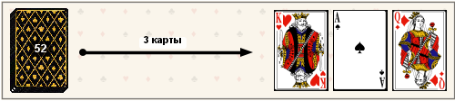

#### Что генерируется:
1. **Колода карт** - стопка из 3 карт со смещением
2. **Размер колоды** - цифра поверх колоды
3. **Стрелка** - соединяет колоду с результатом
4. **Вытянутые карты** - показываются лицевой стороной
5. **Количество карт** - подпись на стрелке (если больше 1)

#### Алгоритм генерации:
1. Выбор случайной рубашки из доступных
2. Расчет позиций элементов на холсте 500×110px
3. Отрисовка колоды с номером размера
4. Отрисовка стрелки (длина зависит от количества карт)
5. Отрисовка вытянутых карт в случайном порядке

### Примеры

#### Пример 1: Простая вероятность
```cdsl
TASK CARDS "Вероятность вытянуть туза"
DECK STANDARD 52
DRAW 1 NO_REPLACEMENT
TARGET [ACE HEARTS]
CALCULATE PROBABILITY
```

**Генерирует:**
- Колода из 52 карт
- Стрелка (максимальной длины)
- Одна карта: туз червей
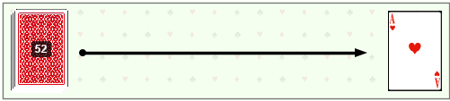
#### Пример 2: Условия подсчета
```cdsl
TASK CARDS "Вытянуть 2 красные карты"
DECK STANDARD 36
DRAW 2 NO_REPLACEMENT
TARGET [COUNT(COLOR RED) = 2]
CALCULATE PROBABILITY
```

**Генерирует:**
- Колода из 36 карт
- Стрелка с подписью "2 карты"
- 2 красные карты (случайные красные масти)
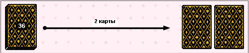
#### Пример 3: Несколько целевых карт
```cdsl
TASK CARDS "Вытянуть короля и даму"
DECK FRENCH 32
DRAW 2 NO_REPLACEMENT
TARGET [KING HEARTS, QUEEN DIAMONDS]
CALCULATE COMBINATIONS
```

**Генерирует:**
- Колода из 32 карт
- Стрелка с подписью "2 карты"
- Король червей и дама бубен
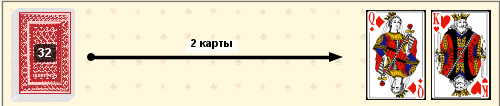
---

## 2. Задачи со словами (`WORDS`)

### Описание
Задачи с формированием слов из алфавита: подсчет количества слов, удовлетворяющих заданным условиям.

### Синтаксис CDSL
```cdsl
TASK WORDS "Название задачи"
ALPHABET "буквы"
LENGTH <длина_слова>
UNIQUE <YES/NO>
CONDITION "условие"
```

### Токены и параметры

#### Основные команды:
- **`TASK WORDS`** - объявление задачи со словами
- **`ALPHABET`** или **`SET`** - алфавит (строка в кавычках)
- **`LENGTH`** - длина слова (число)
- **`UNIQUE`** - уникальность букв:
    - `YES`, `TRUE` - буквы не повторяются
    - `NO`, `FALSE` - буквы могут повторяться
    - `ALLOW_DUPLICATES` - синоним `NO`
- **`CONDITION`** - условия для слов (строка в кавычках)

#### Условия для слов:
- **Русские варианты**:
    - `"ПАЛИНДРОМ"` - слово читается одинаково слева направо и справа налево
    - `"ЧЕРЕДУЮТСЯ ГЛАСНЫЕ И СОГЛАСНЫЕ"` - буквы чередуются гласная/согласная
    - `"СОГЛАСНАЯ ПЕРЕД ГЛАСНОЙ"` - после каждой согласной идет гласная
    - `"ГЛАСНАЯ ПЕРЕД СОГЛАСНОЙ"` - после каждой гласной идет согласная
    - `"ГЛАСНЫХ БОЛЬШЕ ЧЕМ СОГЛАСНЫХ"` - больше гласных букв
    - `"СОГЛАСНЫХ БОЛЬШЕ ЧЕМ ГЛАСНЫХ"` - больше согласных букв
    - `"ГЛАСНЫХ СТОЛЬКО ЖЕ СКОЛЬКО СОГЛАСНЫХ"` - равное количество

- **Английские варианты**:
    - `"PALINDROME"`
    - `"ALTERNATING_VOWELS_CONSONANTS"`
    - `"CONSONANT_FOLLOWED_BY_VOWEL"`
    - `"VOWEL_FOLLOWED_BY_CONSONANT"`
    - `"MORE_VOWELS_THAN_CONSONANTS"`
    - `"MORE_CONSONANTS_THAN_VOWELS"`
    - `"EQUAL_VOWELS_CONSONANTS"`

### Генерация изображения

#### Визуальные элементы:
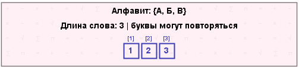

#### Что генерируется:
1. **Алфавит** - отображение доступных букв в сетке
2. **Длина слова** - указание количества букв
3. **Уникальность** - иконка или текст (если буквы уникальны)
4. **Условия** - список условий под алфавитом

#### Алгоритм генерации:
1. Разбиение алфавита на строки для красивого отображения
2. Расчет позиций блоков на холсте
3. Отрисовка алфавита в виде сетки
4. Добавление метаданных (длина, уникальность)
5. Отображение условий в нижней части

### Примеры

#### Пример 1: Простой перебор
```cdsl
TASK WORDS "Слова из букв АБВ"
ALPHABET "АБВ"
LENGTH 3
UNIQUE NO
```

**Генерирует:**
- Алфавит: А, Б, В
- Длина: 3 буквы
- Буквы могут повторяться

#### Пример 2: С условиями
```cdsl
TASK WORDS "Палиндромы"
ALPHABET "АБВГД"
LENGTH 5
UNIQUE YES
CONDITION "ПАЛИНДРОМ"
```
**Генерирует:**
- Алфавит из 5 букв
- Длина: 5 букв
- Уникальные буквы
- Условие: ПАЛИНДРОМ
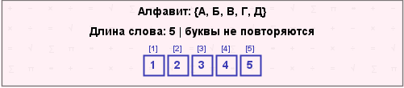
#### Пример 3: Несколько условий
```cdsl
TASK WORDS "Сложные слова"
ALPHABET "ABCDE"
LENGTH 4
UNIQUE NO
CONDITION "ALTERNATING_VOWELS_CONSONANTS"
CONDITION "MORE_CONSONANTS_THAN_VOWELS"
```

**Генерирует:**
- Алфавит: A, B, C, D, E
- Длина: 4 буквы
- Повторяющиеся буквы разрешены
- Два условия: чередование и больше согласных
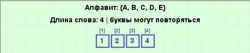
---

## 3. Шахматные задачи (`CHESS`)

### Описание
Задачи с расстановкой шахматных фигур на доске: подсчет способов размещения с учетом атакующих/неатакующих позиций.

### Синтаксис CDSL
```cdsl
TASK CHESS "Название задачи"
BOARD_HEIGHT <высота>
BOARD_WIDTH <ширина>
PIECES [<фигура1> <количество>, ...]
ATTACKING | NON_ATTACKING
```

### Токены и параметры

#### Основные команды:
- **`TASK CHESS`** - объявление шахматной задачи
- **`BOARD_HEIGHT`** или **`HEIGHT`** - высота доски (число)
- **`BOARD_WIDTH`** или **`WIDTH`** - ширина доски (число)
- **`PIECES`** - список фигур в квадратных скобках
- **`ATTACKING`** - фигуры атакуют друг друга
- **`NON_ATTACKING`** - фигуры не атакуют друг друга

#### Шахматные фигуры:
- `CHESS_ROOK` или `ROOK` - ладья
- `CHESS_KNIGHT` или `KNIGHT` - конь
- `CHESS_BISHOP` или `BISHOP` - слон
- `CHESS_QUEEN` или `QUEEN` - ферзь
- `CHESS_KING` или `KING` - король
- `CHESS_PAWN` или `PAWN` - пешка

**Формат:** `[ROOK 2, KNIGHT 3]` - 2 ладьи и 3 коня

#### Типы размещения:
- `ATTACKING` - фигуры размещаются так, чтобы атаковать друг друга
- `NON_ATTACKING` - фигуры размещаются так, чтобы не атаковать друг друга

### Генерация изображения

#### Визуальные элементы:
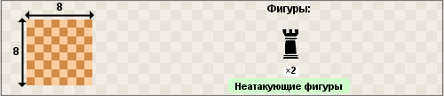

#### Что генерируется:
1. **Шахматная доска** - миниатюрная доска 8×8 клеток
2. **Размеры доски** - стрелки с числами по бокам
3. **Фигуры** - изображения шахматных фигур с количеством
4. **Тип размещения** - подпись "Атакующие" или "Неатакующие"

#### Алгоритм генерации:
1. Отрисовка шахматной доски (реалистичной или простой)
2. Добавление размерных стрелок
3. Загрузка изображений фигур (черные фигуры по умолчанию)
4. Отображение фигур с количеством в случайном порядке
5. Добавление подписи типа размещения

### Примеры

#### Пример 1: Ладьи на доске
```cdsl
TASK CHESS "Расстановка ладей"
BOARD_HEIGHT 8
BOARD_WIDTH 8
PIECES [CHESS_ROOK 2]
NON_ATTACKING
```

**Генерирует:**
- Доска 8×8
- 2 ладьи (изображения)
- Подпись: "Неатакующие фигуры"
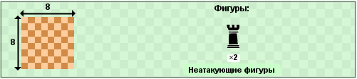
#### Пример 2: Смешанные фигуры
```cdsl
TASK CHESS "Комплексная расстановка"
BOARD_HEIGHT 5
BOARD_WIDTH 5
PIECES [CHESS_ROOK 2, CHESS_KNIGHT 3, CHESS_BISHOP 1]
ATTACKING
```

**Генерирует:**
- Доска 5×5
- 2 ладьи, 3 коня, 1 слон
- Подпись: "Атакующие фигуры"
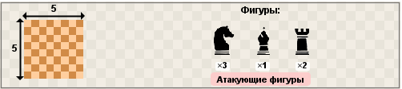
#### Пример 3: Только размеры
```cdsl
TASK CHESS "Пустая доска"
BOARD_HEIGHT 10
BOARD_WIDTH 10
```

**Генерирует:**
- Доска 10×10 (стрелки показывают 10)
- Нет фигур
- Подпись по центру: "Атакующие фигуры" или "Неатакующие фигуры"
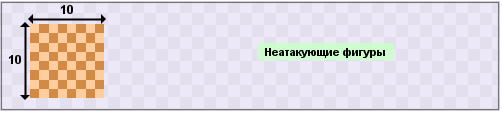
---

## 4. Задачи с числами (`NUMBERS`)

### Описание
Задачи с формированием чисел из цифр: подсчет комбинаций с различными условиями на цифры.

### Синтаксис CDSL
```cdsl
TASK NUMBERS "Название задачи"
DIGITS <количество_цифр>
MAX_DIGIT <максимальная_цифра>
FIRST_NOT_ZERO
DISTINCT <YES/NO>
ADJACENT_DIFFERENT <YES/NO>
ORDER <тип_порядка>
COMPARE [позиции] <оператор> [позиции]
```

### Токены и параметры

#### Основные команды:
- **`TASK NUMBERS`** - объявление задачи с числами
- **`DIGITS`** или **`NUMBER_LENGTH`** - количество цифр в числе
- **`MAX_DIGIT`** - максимальная цифра (по умолчанию 9)
- **`FIRST_NOT_ZERO`** - первая цифра не может быть 0
- **`DISTINCT`** - все цифры различны
- **`ADJACENT_DIFFERENT`** - соседние цифры различны
- **`ORDER`** - порядок цифр:
    - `ASCENDING` или `ASC` - строго возрастающий
    - `DESCENDING` или `DESC` - строго убывающий
    - `NON_DECREASING` - неубывающий
    - `NON_INCREASING` - невозрастающий
- **`COMPARE`** - сравнение сумм цифр на позициях
- **`TOTAL`** - равенство сумм (синоним `COMPARE ... = ...`)

#### Позиции цифр:
- `[1]`, `[2]`, ..., `[n]` - обозначения позиций цифр в числе
- **Пример**: `[1][3][5]` - первая, третья и пятая цифры

#### Операторы сравнения:
- `>` - больше
- `<` - меньше
- `=` или `==` - равно
- `>=` - больше или равно
- `<=` - меньше или равно
- `!=` - не равно

### Генерация изображения

#### Визуальные элементы:
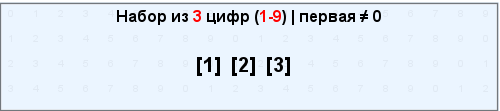

#### Что генерируется:
1. **Визуализация числа** - места для цифр (пустые клетки)
2. **Количество цифр** - отображение длины числа
3. **Диапазон цифр** - минимальная и максимальная цифра
4. **Список условий** - все примененные условия
5. **Сравнения** - если есть условия COMPARE или TOTAL

#### Алгоритм генерации:
1. Создание "шаблона" числа с указанным количеством цифр
2. Добавление метаданных (диапазон, первая цифра)
3. Формирование списка условий в маркированном списке
4. Отображение условий сравнения (если есть)
5. Распределение элементов по холсту 500×110px

### Примеры

#### Пример 1: Простые числа
```cdsl
TASK NUMBERS "Трехзначные числа"
DIGITS 3
FIRST_NOT_ZERO
```

**Генерирует:**
- Шаблон: 3 цифры
- Условие: первая цифра ≠ 0
- Диапазон: 0-9 (по умолчанию)

#### Пример 2: Сложные условия
```cdsl
TASK NUMBERS "Специальные числа"
DIGITS 5
MAX_DIGIT 7
FIRST_NOT_ZERO
DISTINCT YES
ADJACENT_DIFFERENT YES
ORDER ASCENDING
```

**Генерирует:**
- Шаблон: 5 цифр
- Диапазон: 0-7
- 4 условия: первая ≠ 0, все различны, соседние различны, возрастающий порядок
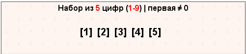
#### Пример 3: Сравнение сумм
```cdsl
TASK NUMBERS "Сравнение сумм"
DIGITS 6
COMPARE [1][2][3] > [4][5][6]
```

**Генерирует:**
- Шаблон: 6 цифр
- Условие: сумма первых трех цифр > сумма последних трех цифр
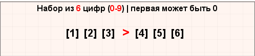
#### Пример 4: Равенство сумм
```cdsl
TASK NUMBERS "Равные суммы"
DIGITS 4
TOTAL [1][2] = [3][4]
```

**Генерирует:**
- Шаблон: 4 цифр
- Условие: сумма первых двух цифр = сумма последних двух цифр
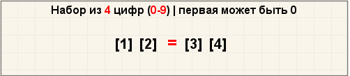
---

## 5. Задачи на делимость (`DIVISIBILITY`)

### Описание
Задачи с поиском чисел, которые при определенных преобразованиях делятся на заданные числа или увеличиваются/уменьшаются в целое число раз.

### Синтаксис CDSL
```cdsl
TASK DIVISIBILITY "Название задачи"
DIGITS <количество_цифр>
RULE "описание правила"
DIVIDES_BY <делитель>
INCREASES_BY_FACTOR <множитель>
DECREASES_BY_FACTOR <множитель>
[позиции_цифр]
```

### Токены и параметры

#### Основные команды:
- **`TASK DIVISIBILITY`** - объявление задачи на делимость
- **`DIGITS`** или **`NUMBER_LENGTH`** - количество цифр в исходном числе
- **`RULE`** или **`FORMATION_RULE`** - правило преобразования числа (строка)
- **`DIVIDES_BY`** - делитель (число)
- **`INCREASES_BY_FACTOR`** - увеличивается в N раз
- **`DECREASES_BY_FACTOR`** - уменьшается в N раз
- **`INCREASES_BY_INTEGER`** - увеличивается в целое число раз
- **`DECREASES_BY_INTEGER`** - уменьшается в целое число раз

#### Позиции цифр:
- `[1]`, `[2]`, `[3]`, ... - позиции цифр для изменения
- **Пример**: `[1][3][5]` - меняются первая, третья и пятая цифры

#### Преобразования:
- **`TRANSFORMATION`** - описание преобразования
- **`CHANGE_RULE`** - правило изменения цифр
- **`FORM_NUMBER`** - создание числа из цифр

#### Дополнительные условия:
- **`CANNOT_BE_ZERO`** - цифра не может быть 0
- **`SINGLE_DIGIT`** - результат состоит из одной цифры
- **`UNCHANGED`** - не меняется
- **`RESULTING_NUMBER`** - полученное число
- **`RESULT`** - результат преобразования

### Генерация изображения

#### Визуальные элементы:


#### Что генерируется:
1. **Исходное число** - шаблон с позициями цифр
2. **Правило преобразования** - описание как меняются цифры
3. **Результат** - что происходит с числом после преобразования
4. **Дополнительные условия** - ограничения на цифры

#### Алгоритм генерации:
1. Отображение шаблона числа с указанным количеством цифр
2. Описание правила преобразования (текст или схема)
3. Указание результата (делимость или изменение размера)
4. Добавление дополнительных условий списком
5. Использование стрелок для показа последовательности преобразований

### Примеры

#### Пример 1: Делимость после перестановки
```cdsl
TASK DIVISIBILITY "Перестановка цифр"
DIGITS 3
RULE "цифры переставляются"
DIVIDES_BY 7
```

**Генерирует:**
- 3-значное число
- Правило: "цифры переставляются"
- Результат: "делится на 7"
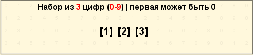
#### Пример 2: Увеличение в несколько раз
```cdsl
TASK DIVISIBILITY "Увеличение числа"
DIGITS 2
RULE "цифры меняются местами"
INCREASES_BY_FACTOR 4
```

**Генерирует:**
- 2-значное число
- Правило: "цифры меняются местами"
- Результат: "увеличивается в 4 раза"
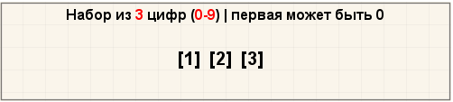
#### Пример 3: Смена конкретных позиций
```cdsl
TASK DIVISIBILITY "Смена позиций"
DIGITS 4
[1][3]
INCREASES_BY_INTEGER
CANNOT_BE_ZERO
```

**Генерирует:**
- 4-значное число
- Правило: "меняются цифры на позициях [1] и [3]"
- Результат: "увеличивается в целое число раз"
- Условие: "цифры не могут быть 0"
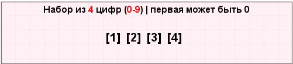
#### Пример 4: Сложное преобразование
```cdsl
TASK DIVISIBILITY "Сложное правило"
DIGITS 5
RULE "первые три цифры умножаются на 2"
DECREASES_BY_FACTOR 3
```

**Генерирует:**
- 5-значное число
- Правило: "первые три цифры умножаются на 2"
- Результат: "уменьшается в 3 раза"
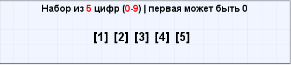
---

## 6. Задачи на остатки (`REMAINDERS`)

### Описание
Задачи с поиском чисел, которые при делении на заданный делитель дают определенный остаток.

### Синтаксис CDSL
```cdsl
TASK REMAINDERS "Название задачи"
DIVIDEND <делимое>
DIVISOR <делитель>
REMAINDER <остаток>
```

### Токены и параметры

#### Основные команды:
- **`TASK REMAINDERS`** - объявление задачи на остатки
- **`DIVIDEND`** - делимое (может быть переменной или выражением)
- **`DIVISOR`** - делитель (число)
- **`REMAINDER`** - остаток (число)

#### Форматы делимого:
- Переменная: `X`, `Y`, `N`
- Выражение: `X+1`, `2X`, `X²`
- Конкретное число: `123`, `1000`

### Генерация изображения

#### Визуальные элементы:


#### Что генерируется:
1. **Математическая запись** - в нотации сравнений по модулю
2. **Уравнение в столбик** - традиционная запись деления
3. **Текстовое описание** - формулировка задачи
4. **Область поиска** - если указаны ограничения

#### Алгоритм генерации:
1. Преобразование в математическую нотацию (≡ mod)
2. Создание наглядной записи деления
3. Формулировка задачи текстом
4. Добавление графических элементов (знак деления, скобки)

### Примеры

#### Пример 1: Простой остаток
```cdsl
TASK REMAINDERS "Остаток от деления"
DIVIDEND "X"
DIVISOR 5
REMAINDER 3
```

**Генерирует:**
- Формула: X ≡ 3 (mod 5)
- Запись: X ÷ 5 = ? (остаток 3)
- Описание: "Найти все X, которые при делении на 5 дают остаток 3"
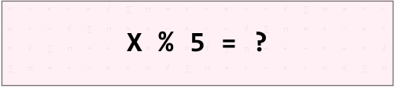
#### Пример 2: Выражение в делимом
```cdsl
TASK REMAINDERS "Сложный остаток"
DIVIDEND "X+1"
DIVISOR 7
REMAINDER 0
```

**Генерирует:**
- Формула: X+1 ≡ 0 (mod 7)
- Запись: (X+1) ÷ 7 = ? (остаток 0)
- Описание: "Найти все X, такие что X+1 делится нацело на 7"
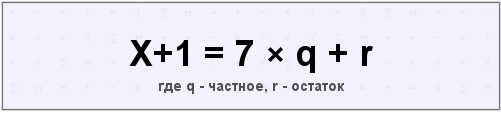
#### Пример 3: Конкретное число
```cdsl
TASK REMAINDERS "Проверка делимости"
DIVIDEND 100
DIVISOR 3
REMAINDER 1
```

**Генерирует:**
- Формула: 100 ≡ 1 (mod 3)
- Запись: 100 ÷ 3 = 33 (остаток 1)
- Описание: "Проверить, что 100 при делении на 3 дает остаток 1"
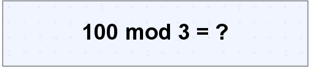
---

## 7. Задачи с уравнениями (`EQUATIONS`)

### Описание
Задачи с поиском решений уравнений в целых числах с заданными ограничениями.

### Синтаксис CDSL
```cdsl
TASK EQUATIONS "Название задачи"
UNKNOWNS <количество_неизвестных>
SUM <сумма>
DOMAIN "область_определения"
CONSTRAINTS ["условие1", "условие2"]
```

### Токены и параметры

#### Основные команды:
- **`TASK EQUATIONS`** - объявление задачи с уравнениями
- **`UNKNOWNS`** - количество неизвестных переменных
- **`SUM`** - сумма переменных (если применимо)
- **`DOMAIN`** - область определения переменных
- **`CONSTRAINTS`** - дополнительные ограничения

#### Области определения:
- `"NATURAL"` - натуральные числа (1, 2, 3, ...)
- `"INTEGER"` - целые числа (..., -2, -1, 0, 1, 2, ...)
- `"POSITIVE"` - положительные числа
- `"NON_NEGATIVE"` - неотрицательные числа
- Диапазон: `"1-10"`, `"0-100"`

#### Ограничения:
- Неравенства: `"x1 < x2"`, `"x3 >= 5"`
- Условия на разность: `"x2 - x1 > 3"`
- Четность: `"x1 четное"`, `"x2 нечетное"`
- Уникальность: `"все x различны"`

#### Переменные:
- `x1`, `x2`, ..., `x10` - именованные переменные
- В формате: `x[цифра]`

### Генерация изображения

#### Визуальные элементы:


#### Что генерируется:
1. **Уравнение** - основное уравнение с переменными
2. **Область определения** - множество допустимых значений
3. **Список ограничений** - дополнительные условия
4. **Математические символы** - proper математические обозначения

#### Алгоритм генерации:
1. Форматирование уравнения с подстрочными индексами
2. Отображение области определения с математическими символами (ℕ, ℤ, ℝ)
3. Создание маркированного списка ограничений
4. Использование математического шрифта для переменных

### Примеры

#### Пример 1: Простое уравнение
```cdsl
TASK EQUATIONS "Сумма трех чисел"
UNKNOWNS 3
SUM 10
DOMAIN "NATURAL"
```

**Генерирует:**
- Уравнение: x₁ + x₂ + x₃ = 10
- Область: xᵢ ∈ ℕ
- Без дополнительных ограничений
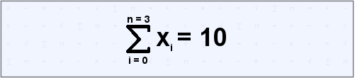
#### Пример 2: С ограничениями
```cdsl
TASK EQUATIONS "Упорядоченные числа"
UNKNOWNS 4
SUM 20
DOMAIN "1-10"
CONSTRAINTS ["x1 < x2 < x3 < x4", "все различны"]
```

**Генерирует:**
- Уравнение: x₁ + x₂ + x₃ + x₄ = 20
- Область: 1 ≤ xᵢ ≤ 10
- Ограничения:
    - x₁ < x₂ < x₃ < x₄
    - все x различны
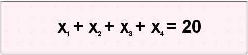
#### Пример 3: Со сложными условиями
```cdsl
TASK EQUATIONS "Четные и нечетные"
UNKNOWNS 3
SUM 25
DOMAIN "POSITIVE"
CONSTRAINTS ["x1 четное", "x2 нечетное", "x3 > x1 + x2"]
```

**Генерирует:**
- Уравнение: x₁ + x₂ + x₃ = 25
- Область: xᵢ > 0
- Ограничения:
    - x₁ четное
    - x₂ нечетное
    - x₃ > x₁ + x₂
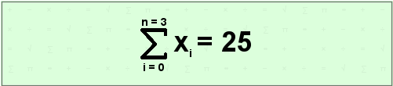
---

## 8. Задачи с шарами и урнами (`BALLS_AND_URNS`)

### Описание
Задачи с извлечением шаров из урны: вероятности, комбинации, математические ожидания.

### Синтаксис CDSL
```cdsl
TASK BALLS "Название задачи"
URN [<цвет1> <количество>, ...]
DRAW [<цвет1> <количество>, ...]
SEQUENTIAL | SIMULTANEOUS
```

### Токены и параметры

#### Основные команды:
- **`TASK BALLS`** - объявление задачи с шарами и урнами
- **`URN`** - содержимое урны (список цветов и количеств)
- **`DRAW`** - что вытягивается (список цветов и количеств)
- **`SEQUENTIAL`** - последовательное вытягивание
- **`SIMULTANEOUS`** - одновременное вытягивание

#### Цвета шаров:
- `RED` - красные
- `BLUE` - синие
- `GREEN` - зеленые
- `WHITE` - белые
- `BLACK` - черные

**Формат:** `[RED 3, BLUE 5, GREEN 2]` - 3 красных, 5 синих, 2 зеленых

#### Типы вытягивания:
- `SEQUENTIAL` - шары вытягиваются по одному (важен порядок)
- `SIMULTANEOUS` - шары вытягиваются одновременно (порядок не важен)

### Генерация изображения

#### Визуальные элементы:


#### Что генерируется:
1. **Урна с шарами** - визуальное представление содержимого урны
2. **Вытягиваемые шары** - что нужно вытянуть
3. **Процесс вытягивания** - стрелка или иконка процесса
4. **Тип вытягивания** - подпись "Последовательно" или "Одновременно"

#### Алгоритм генерации:
1. Создание графического представления урны (контейнер)
2. Отрисовка шаров разными цветами в соответствии с количеством
3. Отображение вытягиваемых шаров отдельно
4. Добавление стрелки или иконки процесса
5. Подпись типа вытягивания

### Примеры

#### Пример 1: Простое вытягивание
```cdsl
TASK BALLS "Вероятность красного шара"
URN [RED 5, BLUE 3]
DRAW [RED 1]
SEQUENTIAL
```

**Генерирует:**
- Урна: 5 красных, 3 синих шара
- Вытягивается: 1 красный шар
- Тип: Последовательно
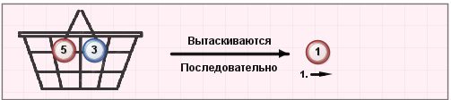
#### Пример 2: Несколько шаров
```cdsl
TASK BALLS "Комбинация цветов"
URN [RED 4, GREEN 3, BLUE 2]
DRAW [RED 2, GREEN 1]
SIMULTANEOUS
```
**Генерирует:**
- Урна: 4 красных, 3 зеленых, 2 синих
- Вытягивается: 2 красных, 1 зеленый
- Тип: Одновременно
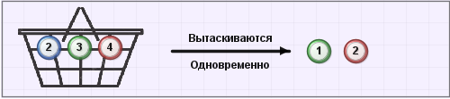
#### Пример 3: Без явного указания вытягивания
```cdsl
TASK BALLS "Общая задача"
URN [WHITE 2, BLACK 5, RED 3]
```

**Генерирует:**
- Урна: 2 белых, 5 черных, 3 красных
- Вытягивается: по умолчанию 1 красный и 1 синий (если есть)
- Тип: Последовательно (по умолчанию)
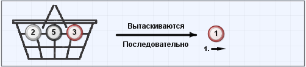
---

## Общие принципы генерации для всех типов задач

### 1. **Структура изображения:**
- Размер: 500×110 пикселей
- Фон: унифицированный с тематическим паттерном
- Макет: левая часть - исходные данные, правая часть - результат/условия

### 2. **Используемые графические элементы:**
- **Фоны** из `BackgroundGenerator` с разными стилями:
    - `CARDS` - карточные масти
    - `CHESS` - шахматная доска
    - `NUMBERS` - цифры в сетке
    - `LETTERS` - буквы в сетке
    - `SYMBOLS` - математические символы
    - `SIMPLE` - простой цвет
    - `GRID` - сетка

- **Стрелки** для показа процессов и преобразований
- **Иконки** для специфических элементов (карты, фигуры, шары)
- **Текст** с форматированием для условий и описаний

### 3. **Порядок рендеринга:**
1. Создание холста BufferedImage
2. Отрисовка фона через BackgroundGenerator
3. Определение типа задачи и вызов соответствующего генератора
4. Расчет расположения элементов на холсте
5. Отрисовка элементов в определенном порядке:
    - Фон и рамка
    - Основные визуальные элементы
    - Текст и метки
    - Декоративные элементы

### 4. **Особенности для каждого типа:**
- **CARDS**: случайный выбор рубашки, перемешивание порядка карт
- **CHESS**: случайный порядок фигур, использование черных фигур
- **WORDS**: форматирование алфавита в читаемом виде
- **NUMBERS**: отображение условий в маркированном списке
- **EQUATIONS**: использование математической нотации
- **BALLS**: цветовое кодирование шаров

### 5. **Обработка ошибок:**
- Если нет изображений для элементов - используются цветные замены
- Если параметры не указаны - применяются значения по умолчанию
- Если задача не поддерживается - генерируется изображение с ошибкой

Эта система позволяет единообразно генерировать визуализации для широкого спектра комбинаторных задач, делая их наглядными и понятными для пользователей.